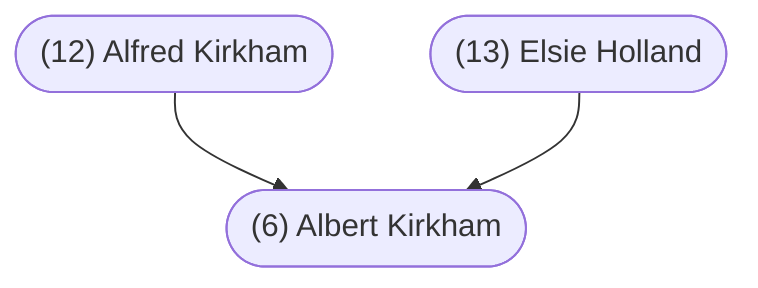

#### Summary

Albert Kirkham was born on July 5, 1928 in Nanaimo, British Columbia, Canada to [[(12) Alfred Kirkham]] and [[(13) Elsie Holland]].

Bert was the sixth of seven children. Bert’s siblings were:

* [[(12i) Clara Mary Kirkham]], born April 6, 1917
* [[(12ii) Alfred Kirkham]], born October 1, 1918
* [[(12iii) Jack Kirkham]], born March 4, 1922
* [[(12iv) Richard Henry Kirkham]], born March 23, 1923
* [[(12v) Lilian Kirkham]], born August 8, 1925
* [[(12vii) James Kirkham]], born April 1, 1934

Bert married [[(7) Lorraine Fitzpatrick]] on March 4, 1961 in Vancouver, British Columbia, Canada.

 

#### Chart

