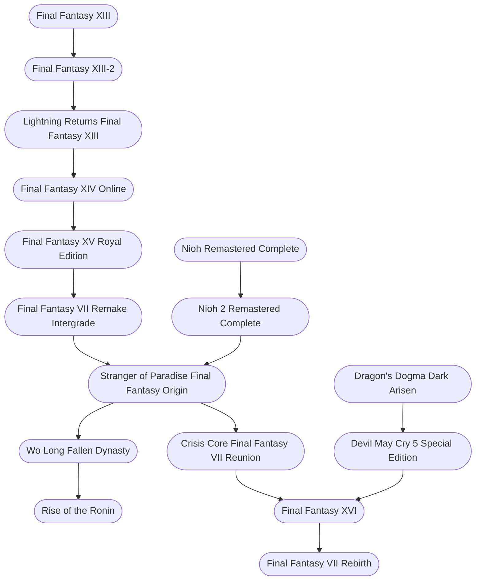

# Fantasy Action

[[playlists]]

#### Timeline

* [[Final Fantasy XIII]], 2009-12-17
* [[Final Fantasy XIII-2]], 2011-12-15
* [[Dragon's Dogma Dark Arisen]], 2013-04-23
* [[Final Fantasy XIV Online]], 2013-08-27
* [[Lightning Returns Final Fantasy XIII]], 2013-11-21
* [[Final Fantasy XV Royal Edition]], 2016-11-29
* [[Nioh Remastered Complete]], 2017-02-07
* [[Devil May Cry 5 Special Edition]], 2019-03-08
* [[Nioh 2 Remastered Complete]], 2020-03-12
* [[Final Fantasy VII Remake Intergrade]], 2020-04-10
* [[Stranger of Paradise Final Fantasy Origin]], 2022-03-14
* [[Crisis Core Final Fantasy VII Reunion]], 2022-12-13
* [[Wo Long Fallen Dynasty]], 2023-03-03
* [[Final Fantasy XVI]], 2023-06-22
* [[Final Fantasy VII Rebirth]], 2024-02-29
* [[Rise of the Ronin]], 2024-03-22

 

#### Developers

* [[Motomu Toriyama]]
* [[Tetsuya Nomura]]
* [[Ryota Suzuki]]
* [[Fumihiko Yasuda]]
* [[Naoki Yoshida]]

 

#### Flowchart

