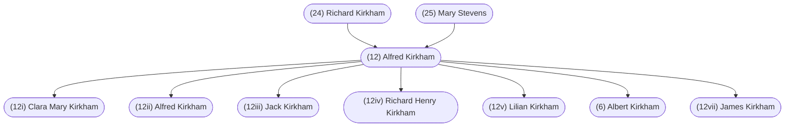

#### Summary

Alfred Kirkham was born on September 19, 1891 in Tipton, Staffordshire, England to [[(24) Richard Kirkham]] and [[(25) Mary Stevens]].

Alfred was the second of three children. Alfred’s siblings were:

* [[Richard Kirkham]], born April 26, 1888
* [[Lilian Kirkham]], born February 24, 1899

Alfred married [[Elsie Holland]] on June 11, 1916 in Tipton, Staffordshire, England.

They had seven children:

* [[(12i) Clara Mary Kirkham]], born April 6, 1917
* [[(12ii) Alfred Kirkham]], born October 1, 1918
* [[(12iii) Jack Kirkham]], born March 4, 1922
* [[(12iv) Richard Henry Kirkham]], born March 23, 1923
* [[(12v) Lilian Kirkham]], born August 8, 1925
* [[(6) Albert Kirkham]], born July 5, 1928
* [[(12vii) James Kirkham]], born April 1, 1934

Alfred died on January 1, 1979 in Vancouver, British Columbia, Canada and was buried in Mountainview Cemetery, section Jones, block 37, space 1659, Vancouver, British Columbia, Canada.

 

#### Chart

