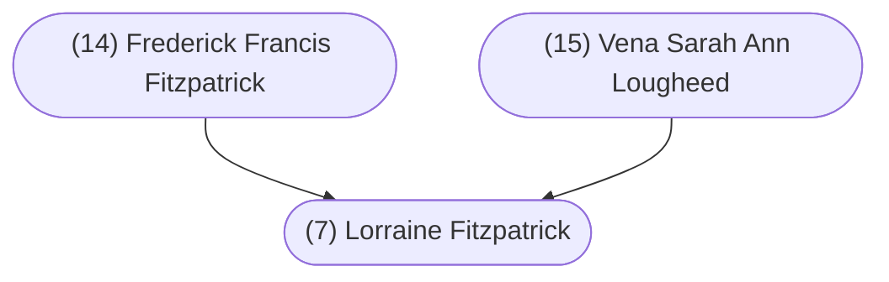

#### Summary

Helen Lorraine Fitzpatrick was born on December 30, 1939 in Vancouver, British Columbia, Canada to [[(14) Frederick Francis Fitzpatrick]] and [[Vena Sarah Ann Lougheed]].

Lorraine was the third of three children. Lorraine’s siblings were:

* [[(14i) Muriel Fern Fitzpatrick]], born April 19, 1924
* [[(14ii) Everett Roy Fitzpatrick]], born April 6, 1926

Lorraine married [[(6) Albert Kirkham]] on March 4, 1961 in Vancouver, British Columbia, Canada.

 

#### Chart

