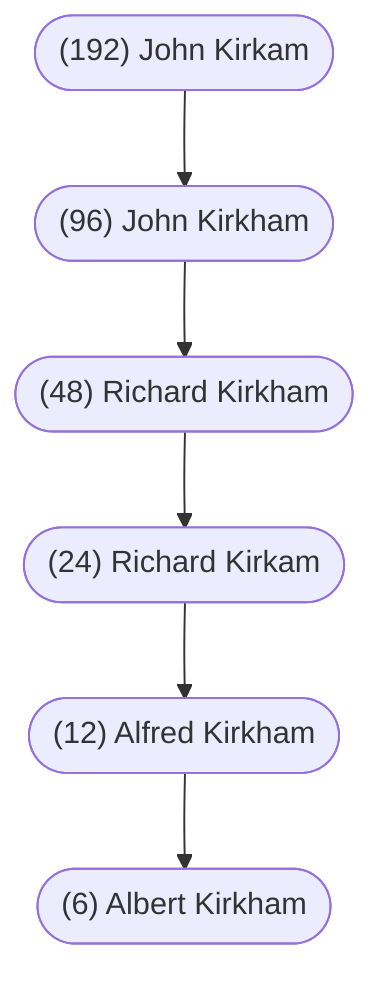

#### Chart

```mermaid
flowchart TD;

AK(["(6) Albert Kirkham"])
AFK(["(12) Alfred Kirkham"])
RK2(["(24) Richard Kirkam"])
RK1(["(48) Richard Kirkham"])
JK2(["(96) John Kirkham"])
JK1(["(192) John Kirkam"])

JK1 --> JK2 --> RK1 --> RK2 --> AFK --> AK

class AK,AFK,RK2,RK1,JK2,JK1 internal-link;

```